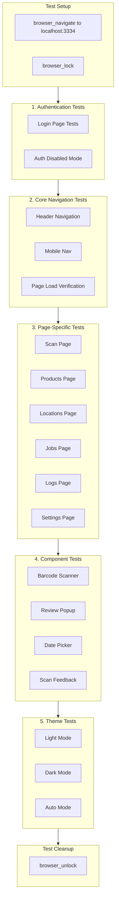

# GrocyScan BrowserMCP UI Testing Plan

## Prerequisites

Before testing, ensure the application is running:

```bash
# Start development services
docker compose -f docker/docker-compose.dev.yml up -d

# Run database migrations
alembic upgrade head

# Start the application
python -m app.main
```

Application runs at: `http://localhost:3334`

---

## Test Architecture




---

## 1. Authentication Tests

### 1.1 Login Page (`/login`)


| Test ID | Test Case                 | BrowserMCP Actions                                      | Expected Result                                                                     |
| ------- | ------------------------- | ------------------------------------------------------- | ----------------------------------------------------------------------------------- |
| AUTH-01 | Verify login page loads   | `browser_navigate` to `/login`, `browser_snapshot`      | Login card visible with "GrocyScan" title, username/password fields, Sign In button |
| AUTH-02 | Empty form validation     | `browser_click` on Sign In without entering credentials | Error message "Please enter username and password"                                  |
| AUTH-03 | Username input            | `browser_fill` username field with "testuser"           | Field shows "testuser"                                                              |
| AUTH-04 | Password input            | `browser_fill` password field with "password123"        | Field shows masked characters                                                       |
| AUTH-05 | Password toggle           | `browser_click` on password visibility toggle           | Password becomes visible/hidden                                                     |
| AUTH-06 | Invalid credentials       | Submit form with invalid credentials                    | Error message displayed                                                             |
| AUTH-07 | Successful login redirect | Submit valid credentials (when auth enabled)            | Redirects to `/scan`                                                                |


---

## 2. Navigation Tests

### 2.1 Header Navigation


| Test ID | Test Case             | BrowserMCP Actions                 | Expected Result                                      |
| ------- | --------------------- | ---------------------------------- | ---------------------------------------------------- |
| NAV-01  | Header visibility     | `browser_snapshot` on any page     | Header with "GrocyScan" logo and nav buttons visible |
| NAV-02  | Navigate to Scan      | `browser_click` "Scan" button      | URL changes to `/scan`, Scan page renders            |
| NAV-03  | Navigate to Products  | `browser_click` "Products" button  | URL changes to `/products`                           |
| NAV-04  | Navigate to Locations | `browser_click` "Locations" button | URL changes to `/locations`                          |
| NAV-05  | Navigate to Jobs      | `browser_click` "Jobs" button      | URL changes to `/jobs`                               |
| NAV-06  | Navigate to Logs      | `browser_click` "Logs" button      | URL changes to `/logs`                               |
| NAV-07  | Navigate to Settings  | `browser_click` "Settings" button  | URL changes to `/settings`                           |
| NAV-08  | Root redirect         | `browser_navigate` to `/`          | Redirects to `/scan`                                 |


### 2.2 Mobile Navigation

Test at mobile viewport (< 640px):


| Test ID | Test Case             | BrowserMCP Actions                                   | Expected Result                          |
| ------- | --------------------- | ---------------------------------------------------- | ---------------------------------------- |
| NAV-09  | Mobile nav visibility | `browser_resize` to mobile width, `browser_snapshot` | Bottom navigation bar visible with icons |
| NAV-10  | Mobile Scan nav       | `browser_click` scanner icon                         | Navigates to `/scan`                     |
| NAV-11  | Mobile Products nav   | `browser_click` inventory icon                       | Navigates to `/products`                 |
| NAV-12  | Mobile Settings nav   | `browser_click` settings icon                        | Navigates to `/settings`                 |


---

## 3. Page-Specific Tests

### 3.1 Scan Page (`/scan`)

Primary scanning interface - the main user workflow.


| Test ID | Test Case             | BrowserMCP Actions                                             | Expected Result                                                 |
| ------- | --------------------- | -------------------------------------------------------------- | --------------------------------------------------------------- |
| SCAN-01 | Page title            | `browser_snapshot`                                             | "Barcode Scanner" heading visible                               |
| SCAN-02 | Location card         | `browser_snapshot`                                             | Location card shows "Not set" initially                         |
| SCAN-03 | Scanner input visible | `browser_snapshot`                                             | Barcode input field with placeholder "Scan or enter barcode..." |
| SCAN-04 | Camera button visible | `browser_snapshot`                                             | Camera scan button (QR icon) present                            |
| SCAN-05 | Manual barcode entry  | `browser_fill` barcode input with "4006381333931", press Enter | Scan initiated, feedback shown                                  |
| SCAN-06 | Submit button click   | `browser_fill` barcode, `browser_click` submit button          | Scan initiated                                                  |
| SCAN-07 | Feedback area         | `browser_snapshot`                                             | "Ready to scan" message with info icon                          |
| SCAN-08 | Recent scans empty    | `browser_snapshot`                                             | "No recent scans" message                                       |
| SCAN-09 | Camera dialog open    | `browser_click` camera button                                  | Camera dialog opens with preview area                           |
| SCAN-10 | Camera dialog close   | `browser_click` Cancel in dialog                               | Dialog closes                                                   |


### 3.2 Products Page (`/products`)


| Test ID | Test Case            | BrowserMCP Actions                   | Expected Result                                               |
| ------- | -------------------- | ------------------------------------ | ------------------------------------------------------------- |
| PROD-01 | Page title           | `browser_snapshot`                   | "Products" heading visible                                    |
| PROD-02 | Add Product button   | `browser_snapshot`                   | "Add Product" button with plus icon                           |
| PROD-03 | Search input         | `browser_snapshot`                   | Search input with placeholder "Search products..."            |
| PROD-04 | Category filter      | `browser_snapshot`                   | Category dropdown with "All Categories" selected              |
| PROD-05 | Category options     | `browser_click` on category dropdown | Shows filter options (All, Groceries, Dairy, Produce, Frozen) |
| PROD-06 | Search functionality | `browser_fill` search with "milk"    | Search filter applied                                         |


### 3.3 Locations Page (`/locations`)


| Test ID | Test Case           | BrowserMCP Actions                                                   | Expected Result                                           |
| ------- | ------------------- | -------------------------------------------------------------------- | --------------------------------------------------------- |
| LOC-01  | Page title          | `browser_snapshot`                                                   | "Locations" heading visible                               |
| LOC-02  | Add Location button | `browser_snapshot`                                                   | "Add Location" button present                             |
| LOC-03  | Sync status card    | `browser_snapshot`                                                   | Grocy Sync status displayed with "Connected" indicator    |
| LOC-04  | Sync Now button     | `browser_click` "Sync Now"                                           | Sync action triggered                                     |
| LOC-05  | Add Location dialog | `browser_click` "Add Location"                                       | Dialog opens with Name, Description, Is freezer           |
| LOC-06  | Create location     | Fill name (e.g. "Test Kitchen"), submit                              | New location appears in list, success notify              |
| LOC-07  | Click location card | `browser_click` on a location card                                   | Detail popup opens with Name, Description, ID, Is freezer |
| LOC-08  | Detail popup Close  | In detail popup, click Close                                         | Popup closes                                              |
| LOC-09  | Edit location       | Open detail popup, click Edit, change name/description/freezer, Save | List and popup show updated values                        |
| LOC-10  | Delete location     | Open detail popup, click Delete, confirm                             | Location removed from list or error if in use             |


### 3.4 Jobs Page (`/jobs`)


| Test ID | Test Case         | BrowserMCP Actions              | Expected Result                                      |
| ------- | ----------------- | ------------------------------- | ---------------------------------------------------- |
| JOB-01  | Page title        | `browser_snapshot`              | "Job Queue" heading visible                          |
| JOB-02  | Stats cards       | `browser_snapshot`              | Four stat cards: Pending, Running, Failed, Completed |
| JOB-03  | Pending stat      | `browser_snapshot`              | Pending count displayed                              |
| JOB-04  | Failed stat color | `browser_snapshot`              | Failed count in red color                            |
| JOB-05  | Status filter     | `browser_snapshot`              | Status dropdown with "All" selected                  |
| JOB-06  | Filter options    | `browser_click` status dropdown | Shows All, Pending, Running, Completed, Failed       |
| JOB-07  | Filter by status  | Select "Failed" from dropdown   | List filters to failed jobs only                     |


### 3.5 Logs Page (`/logs`)


| Test ID | Test Case       | BrowserMCP Actions             | Expected Result                                |
| ------- | --------------- | ------------------------------ | ---------------------------------------------- |
| LOG-01  | Page title      | `browser_snapshot`             | "Application Logs" heading visible             |
| LOG-02  | Level filter    | `browser_snapshot`             | Level dropdown with "All Levels" selected      |
| LOG-03  | Level options   | `browser_click` level dropdown | Shows DEBUG, INFO, WARNING, ERROR options      |
| LOG-04  | Search input    | `browser_snapshot`             | Search input with "Search logs..." placeholder |
| LOG-05  | Refresh button  | `browser_snapshot`             | Refresh button with icon                       |
| LOG-06  | Copy All button | `browser_snapshot`             | Copy All button present                        |
| LOG-07  | Scroll area     | `browser_snapshot`             | Log scroll area with fixed height              |


### 3.6 Settings Page (`/settings`)

Most complex page with 5 tabs.


| Test ID | Test Case        | BrowserMCP Actions | Expected Result                          |
| ------- | ---------------- | ------------------ | ---------------------------------------- |
| SET-01  | Page title       | `browser_snapshot` | "Settings" heading visible               |
| SET-02  | All tabs visible | `browser_snapshot` | 5 tabs: Grocy, LLM, Lookup, Scanning, UI |
| SET-03  | Default tab      | `browser_snapshot` | Grocy tab active by default              |


#### 3.6.1 Grocy Tab


| Test ID | Test Case              | BrowserMCP Actions                                                               | Expected Result                                       |
| ------- | ---------------------- | -------------------------------------------------------------------------------- | ----------------------------------------------------- |
| SET-G01 | API URL field          | `browser_snapshot`                                                               | API URL input with default value                      |
| SET-G02 | API Key field          | `browser_snapshot`                                                               | Password field with toggle button                     |
| SET-G03 | Web URL field          | `browser_snapshot`                                                               | Web URL input field                                   |
| SET-G04 | Edit API URL           | `browser_fill` API URL with "[http://grocy.local:9283](http://grocy.local:9283)" | Field updated                                         |
| SET-G05 | Test Connection button | `browser_snapshot`                                                               | "Test Connection" button visible                      |
| SET-G06 | Click Test Connection  | `browser_click` Test Connection                                                  | Status updates to "Testing connection..." then result |
| SET-G07 | Save button            | `browser_snapshot`                                                               | "Save" button visible                                 |
| SET-G08 | Save settings          | `browser_click` Save                                                             | Notification shown, status updated                    |


#### 3.6.2 LLM Tab


| Test ID | Test Case                | BrowserMCP Actions              | Expected Result                                  |
| ------- | ------------------------ | ------------------------------- | ------------------------------------------------ |
| SET-L01 | Switch to LLM tab        | `browser_click` "LLM" tab       | LLM settings panel shown                         |
| SET-L02 | Provider preset dropdown | `browser_snapshot`              | Dropdown with OpenAI, Anthropic, Ollama, Generic |
| SET-L03 | Select OpenAI preset     | Select "OpenAI" from dropdown   | API URL updates to OpenAI, API Key field shown   |
| SET-L04 | Select Ollama preset     | Select "Ollama" from dropdown   | API Key field hidden, local URL shown            |
| SET-L05 | Model input              | `browser_snapshot`              | Model input field                                |
| SET-L06 | Test LLM button          | `browser_click` Test Connection | Configuration validated                          |


#### 3.6.3 Lookup Tab


| Test ID | Test Case             | BrowserMCP Actions            | Expected Result                                |
| ------- | --------------------- | ----------------------------- | ---------------------------------------------- |
| SET-K01 | Switch to Lookup tab  | `browser_click` "Lookup" tab  | Lookup settings shown                          |
| SET-K02 | Strategy dropdown     | `browser_snapshot`            | Sequential/Parallel options                    |
| SET-K03 | OpenFoodFacts card    | `browser_snapshot`            | Provider card with "Free" badge, toggle switch |
| SET-K04 | Toggle OpenFoodFacts  | `browser_click` toggle switch | Switch state changes                           |
| SET-K05 | go-upc card           | `browser_snapshot`            | Provider card with "API Key" badge             |
| SET-K06 | go-upc API key field  | `browser_snapshot`            | Password input for API key                     |
| SET-K07 | Brave Search fallback | `browser_snapshot`            | "Use as fallback only" switch                  |


#### 3.6.4 Scanning Tab


| Test ID | Test Case              | BrowserMCP Actions                   | Expected Result               |
| ------- | ---------------------- | ------------------------------------ | ----------------------------- |
| SET-S01 | Switch to Scanning tab | `browser_click` "Scanning" tab       | Scanning settings shown       |
| SET-S02 | Auto-add toggle        | `browser_snapshot`                   | Switch for "Auto-add on scan" |
| SET-S03 | Toggle auto-add        | `browser_click` auto-add switch      | Switch toggles                |
| SET-S04 | Kiosk mode toggle      | `browser_snapshot`                   | Switch for "Kiosk mode"       |
| SET-S05 | Fuzzy match threshold  | `browser_snapshot`                   | Number input (0.5-1.0)        |
| SET-S06 | Adjust threshold       | `browser_fill` threshold with "0.85" | Value updated                 |
| SET-S07 | Default quantity unit  | `browser_snapshot`                   | Text input field              |


#### 3.6.5 UI Tab


| Test ID | Test Case         | BrowserMCP Actions             | Expected Result                 |
| ------- | ----------------- | ------------------------------ | ------------------------------- |
| SET-U01 | Switch to UI tab  | `browser_click` "UI" tab       | UI settings shown               |
| SET-U02 | Theme buttons     | `browser_snapshot`             | Light, Dark, Auto buttons       |
| SET-U03 | Click Light theme | `browser_click` "Light" button | Theme changes to light mode     |
| SET-U04 | Click Dark theme  | `browser_click` "Dark" button  | Theme changes to dark mode      |
| SET-U05 | Click Auto theme  | `browser_click` "Auto" button  | Theme follows system preference |
| SET-U06 | Save Theme button | `browser_snapshot`             | "Save Theme Preference" button  |


---

## 4. Component Tests

### 4.1 Barcode Scanner Component


| Test ID | Test Case          | BrowserMCP Actions         | Expected Result               |
| ------- | ------------------ | -------------------------- | ----------------------------- |
| CMP-S01 | Input autofocus    | Navigate to scan page      | Barcode input receives focus  |
| CMP-S02 | Enter key submits  | Type barcode + press Enter | Scan triggered                |
| CMP-S03 | Clear after submit | Submit barcode             | Input field clears            |
| CMP-S04 | Tooltip on camera  | Hover camera button        | "Open camera scanner" tooltip |
| CMP-S05 | Tooltip on submit  | Hover submit button        | "Look up barcode" tooltip     |


### 4.2 Product Review Popup

Trigger by scanning a barcode:


| Test ID | Test Case              | BrowserMCP Actions                 | Expected Result                    |
| ------- | ---------------------- | ---------------------------------- | ---------------------------------- |
| CMP-R01 | Popup opens            | Scan valid barcode                 | 70% width dialog opens             |
| CMP-R02 | Title "Review Product" | `browser_snapshot`                 | Dialog header shows title          |
| CMP-R03 | Close button (X)       | `browser_click` X button           | Dialog closes                      |
| CMP-R04 | Product image area     | `browser_snapshot`                 | Image or placeholder icon          |
| CMP-R05 | Barcode displayed      | `browser_snapshot`                 | Barcode number shown               |
| CMP-R06 | Name field required    | `browser_snapshot`                 | "Product Name *" label             |
| CMP-R07 | Edit name              | `browser_fill` name field          | Value updates                      |
| CMP-R08 | Category field         | `browser_snapshot`                 | Category input                     |
| CMP-R09 | Quantity spinner       | `browser_snapshot`                 | Number input with min=1            |
| CMP-R10 | Adjust quantity        | Change quantity to 3               | Value updates                      |
| CMP-R11 | Location display       | `browser_snapshot`                 | Shows current location if set      |
| CMP-R12 | Date picker present    | `browser_snapshot`                 | Best Before date picker            |
| CMP-R13 | Price field            | `browser_snapshot`                 | Optional price input               |
| CMP-R14 | Notes field            | `browser_snapshot`                 | Optional textarea                  |
| CMP-R15 | Cancel button          | `browser_click` Cancel             | Dialog closes without action       |
| CMP-R16 | Confirm button         | `browser_click` "Add to Inventory" | Product added, notification shown  |
| CMP-R17 | Empty name validation  | Clear name, click Confirm          | Warning "Product name is required" |


### 4.3 Touch Date Picker


| Test ID | Test Case            | BrowserMCP Actions                     | Expected Result                              |
| ------- | -------------------- | -------------------------------------- | -------------------------------------------- |
| CMP-D01 | Initial display      | `browser_snapshot`                     | Shows "No expiration date" or current value  |
| CMP-D02 | Quick-select buttons | `browser_snapshot`                     | TODAY, +3D, +1W, +2W, +1M, +3M, NONE buttons |
| CMP-D03 | Click TODAY          | `browser_click` TODAY                  | Date set to today, button highlighted        |
| CMP-D04 | Click +3D            | `browser_click` +3D                    | Date set to today + 3 days                   |
| CMP-D05 | Click +1W            | `browser_click` +1W                    | Date set to today + 7 days                   |
| CMP-D06 | Click +1M            | `browser_click` +1M                    | Date set to today + 30 days                  |
| CMP-D07 | Click NONE           | `browser_click` NONE                   | Date cleared, shows "No expiration date"     |
| CMP-D08 | Calendar expansion   | `browser_click` "Choose specific date" | Calendar widget expands                      |
| CMP-D09 | Select from calendar | Pick a specific date                   | Date updates                                 |
| CMP-D10 | Button highlight     | Select via quick-select                | Active button shows primary color            |


### 4.4 Scan Feedback Component


| Test ID | Test Case     | BrowserMCP Actions      | Expected Result                        |
| ------- | ------------- | ----------------------- | -------------------------------------- |
| CMP-F01 | Initial state | `browser_snapshot`      | Gray background, "Ready to scan"       |
| CMP-F02 | Success state | Scan valid product      | Green background, check icon           |
| CMP-F03 | Error state   | Trigger error condition | Red background, error icon             |
| CMP-F04 | Warning state | Scan unknown barcode    | Yellow/orange background, warning icon |


---

## 5. Responsive Design Tests

Test at different viewports:


| Viewport | Width  | Test Focus                                            |
| -------- | ------ | ----------------------------------------------------- |
| Mobile   | 375px  | Bottom nav visible, single column, full-width buttons |
| Tablet   | 768px  | Two columns where appropriate                         |
| Desktop  | 1280px | Full layout, header navigation                        |


| Test ID | Test Case            | BrowserMCP Actions                | Expected Result                          |
| ------- | -------------------- | --------------------------------- | ---------------------------------------- |
| RSP-01  | Mobile scan page     | Resize to 375px, navigate to scan | Single column layout, mobile nav visible |
| RSP-02  | Tablet products page | Resize to 768px                   | Adjusted layout                          |
| RSP-03  | Desktop settings     | Resize to 1280px                  | Full width tabs                          |
| RSP-04  | Touch targets mobile | Check button sizes at mobile      | Minimum 48x48px touch targets            |


---

## 6. Theme Tests


| Test ID | Test Case           | BrowserMCP Actions                  | Expected Result              |
| ------- | ------------------- | ----------------------------------- | ---------------------------- |
| THM-01  | Light mode colors   | Set Light theme, `browser_snapshot` | Light backgrounds, dark text |
| THM-02  | Dark mode colors    | Set Dark theme, `browser_snapshot`  | Dark backgrounds, light text |
| THM-03  | Header in dark mode | `browser_snapshot` header           | Primary color maintained     |
| THM-04  | Cards in dark mode  | `browser_snapshot` cards            | Dark card backgrounds        |
| THM-05  | Theme persistence   | Refresh page after setting theme    | Theme maintained             |


---

## 7. Notification/Toast Tests


| Test ID | Test Case              | BrowserMCP Actions         | Expected Result            |
| ------- | ---------------------- | -------------------------- | -------------------------- |
| NOT-01  | Success notification   | Complete successful action | Green notification appears |
| NOT-02  | Error notification     | Trigger error              | Red notification appears   |
| NOT-03  | Warning notification   | Trigger warning            | Orange/yellow notification |
| NOT-04  | Notification dismissal | Wait or click dismiss      | Notification disappears    |


---

## Test Execution Template

```python
# BrowserMCP Test Execution Pattern
async def test_scan_page():
    # 1. Navigate
    await browser_navigate("http://localhost:3334/scan")
    
    # 2. Lock browser for interactions
    await browser_lock()
    
    # 3. Take snapshot to see page state
    snapshot = await browser_snapshot()
    
    # 4. Perform interactions
    await browser_fill(ref="barcode_input", text="4006381333931")
    await browser_click(ref="submit_button")
    
    # 5. Wait for response (short incremental waits)
    await browser_wait(ms=2000)
    snapshot = await browser_snapshot()  # Check result
    
    # 6. Verify results
    assert "Product found" in snapshot.text
    
    # 7. Unlock when done
    await browser_unlock()
```

---

## Scanner Gun Mode – Browser Test Procedure

When validating **Scanner Gun Mode** (USB/Bluetooth barcode scanner optimization):

1. **Navigate** to `/scan`.
2. **Enable Scanner Gun Mode** by clicking the toggle button (crop_free icon) so the barcode input keeps focus after submit.
3. **Ensure focus** is on the barcode input (e.g. element ref `e56` or the barcode input in snapshot) before simulating a scan.
4. **Simulate scan**: type barcode `3017620422003` (e.g. Nutella) into the barcode input and press Enter.
5. **Verify**: "Product found" feedback appears and the **Review Product** dialog opens with product details.
6. **Verify focus**: after closing the dialog (or cancelling), if Scanner Gun Mode is still on, focus should return to the barcode input for the next scan.

Use `browser_snapshot` before/after to confirm input refs and dialog visibility.

---

## Known Issues / UI Notes

- **Images in Review dialog**: Product images are **not** currently shown in the scan Review Product dialog. Lookup results may not include `image_url`, or the review popup does not render it; treat as a known limitation until implemented.
- **Products popup (Grocy) – no UPC**: The product detail popup on the **Products** page (`/products`) shows Grocy product fields (name, description, location, quantity, unit, calories, etc.) but **does not show UPC/barcode**. Barcodes in Grocy live in a separate product_barcodes API; the detail popup does not fetch or display them. Consider adding barcode(s) to the product detail popup in a future change.

---

## Key Files Referenced

- `[app/ui/app.py](app/ui/app.py)` - Route definitions
- `[app/ui/layout.py](app/ui/layout.py)` - Header/footer/mobile nav
- `[app/ui/pages/scan.py](app/ui/pages/scan.py)` - Scan page
- `[app/ui/pages/settings.py](app/ui/pages/settings.py)` - Settings tabs
- `[app/ui/pages/products.py](app/ui/pages/products.py)` - Products page
- `[app/ui/pages/locations.py](app/ui/pages/locations.py)` - Locations page
- `[app/ui/pages/jobs.py](app/ui/pages/jobs.py)` - Jobs page
- `[app/ui/pages/logs.py](app/ui/pages/logs.py)` - Logs page
- `[app/ui/pages/login.py](app/ui/pages/login.py)` - Login page
- `[app/ui/components/scanner.py](app/ui/components/scanner.py)` - Scanner component
- `[app/ui/components/review_popup.py](app/ui/components/review_popup.py)` - Review popup
- `[app/ui/components/date_picker.py](app/ui/components/date_picker.py)` - Date picker

