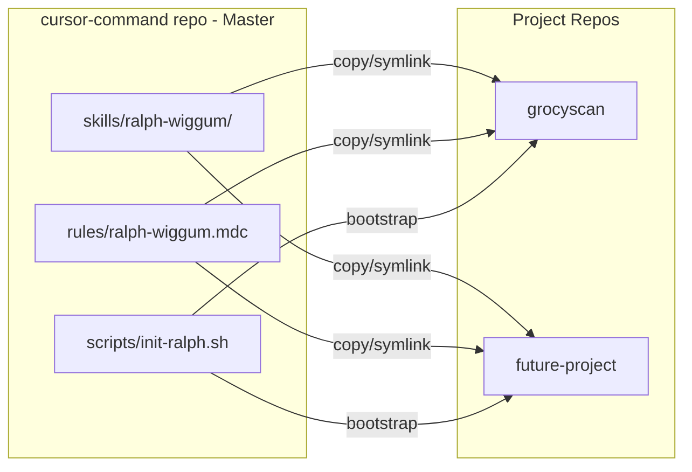
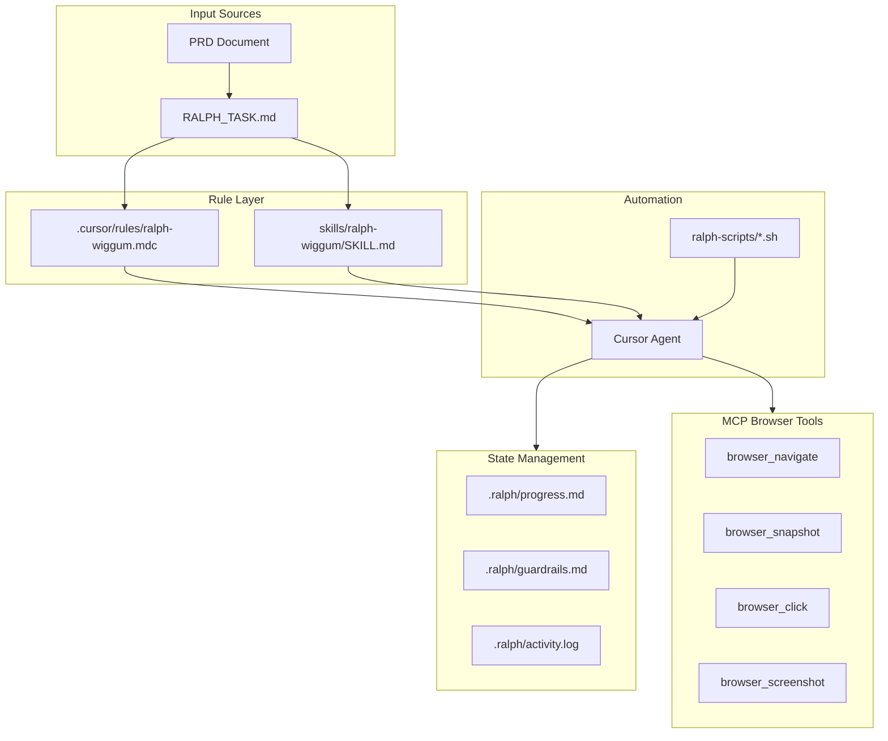

# Ralph Wiggum Methodology Ruleset

## Overview

Create a dual-format Ralph Wiggum methodology that can be:

1. Applied automatically via Cursor rules
2. Shared as a portable Anthropic-style skill
3. Integrated into PRDs for new projects

## Repository Strategy

**Master Repository:** `C:/git/cursor-command/`

- Store canonical skill definitions, rules, and reference documents
- Version-controlled standards that can be shared across all projects
- Single source of truth for Ralph Wiggum methodology

**Project Repositories:** (e.g., `C:/git/grocyscan/`)

- Copy or symlink rules from cursor-command
- Project-specific RALPH_TASK.md and .ralph/ state files
- Automation scripts for running the methodology




## Architecture




## Deliverables

### 1. Enhanced Cursor Rule

**File:** `.cursor/rules/ralph-wiggum.mdc`

Improvements over current `[.cursor/rules/ralph.mdc](C:/git/grocyscan/.cursor/rules/ralph.mdc)`:

- Add MCP browser tool protocol section
- Add PRD-to-task conversion guidelines
- Add validation checkpoints
- Add model-specific instructions
- Improve guardrail format with examples

### 2. Portable Anthropic-Style Skill

**Directory:** `skills/ralph-wiggum/`

Structure following [Anthropic skills spec](https://github.com/anthropics/skills):

```
skills/ralph-wiggum/
├── SKILL.md              # Main skill with frontmatter
├── references/
│   ├── task-format.md    # RALPH_TASK.md specification
│   ├── state-files.md    # State management guide
│   ├── browser-tools.md  # MCP browser integration
│   └── prd-template.md   # PRD section template
└── scripts/
    └── init-ralph.sh     # Project initialization
```

### 3. PRD Template Section

**File:** `skills/ralph-wiggum/references/prd-template.md`

A template section that PRD-generating agents can include:

- Ralph methodology overview
- Task breakdown guidelines
- Success criteria format
- Test command specification
- Browser validation requirements

### 4. MCP Browser Integration

**New section in both rule and skill:**

```markdown
## MCP Browser Tools Protocol

### Workflow
1. browser_tabs (list) - Check existing tabs
2. browser_navigate - Open target URL
3. browser_lock - Lock browser for interactions
4. browser_snapshot - Get page structure
5. [interactions] - click, type, fill, scroll
6. browser_screenshot - Capture evidence
7. browser_unlock - Release browser

### Validation Pattern
For each UI-related criterion:
1. Navigate to relevant page
2. Snapshot to verify state
3. Interact as needed
4. Screenshot for evidence
5. Update progress with screenshot reference
```

## Key Sections in Rule/Skill

### Startup Sequence (enhanced)

1. Read RALPH_TASK.md - find unchecked criteria
2. Read .ralph/guardrails.md - follow lessons learned
3. Read .ralph/progress.md - avoid repeating work
4. Check git log - understand current state
5. **NEW:** Check MCP browser availability for UI tasks

### Work Loop (enhanced)

1. Focus on ONE criterion
2. Implement the code
3. Run test_command from frontmatter
4. **NEW:** If UI criterion, validate with browser tools
5. Commit with `ralph: [criterion]` prefix
6. Update RALPH_TASK.md (`[ ]` → `[x]`)
7. Update .ralph/progress.md

### Failure Protocol (enhanced)

1. Don't repeat the same approach
2. Add guardrail to .ralph/guardrails.md
3. **NEW:** If browser-related failure, capture screenshot
4. Try different approach or move to next criterion

### Signals

- `<ralph>COMPLETE</ralph>` - All criteria done
- `<ralph>BLOCKED</ralph>` - Need human input
- `<ralph>GUTTER</ralph>` - Stuck in failure loop
- **NEW:** `<ralph>BROWSER_NEEDED</ralph>` - UI validation required

## Implementation Details

### RALPH_TASK.md Format (enhanced)

```yaml
---
task: Build feature X
test_command: "pytest tests/ -v"
browser_validation: true  # NEW: enables MCP browser checks
base_url: "http://localhost:3000"  # NEW: for browser testing
---
```

### Guardrail Format (standardized)

```markdown
### Sign: [Short description]
- **Trigger**: When this situation occurs
- **Instruction**: What to do instead
- **Evidence**: Screenshot or log reference
- **Added after**: Iteration N - reason
```

### Progress Format (enhanced)

```markdown
## Session N (Date)
### Completed
- [x] Criterion 1 - commit abc123
  - Screenshot: .ralph/screenshots/criterion-1.png

### Browser Validations
- Page X loaded correctly
- Form Y submitted successfully
```

## Files to Create/Modify

### Master Repository (C:/git/cursor-command/)


| File                                              | Action | Purpose                                                     |
| ------------------------------------------------- | ------ | ----------------------------------------------------------- |
| `skills/ralph-wiggum/SKILL.md`                    | Create | Main skill definition with Anthropic-compatible frontmatter |
| `skills/ralph-wiggum/references/task-format.md`   | Create | RALPH_TASK.md specification                                 |
| `skills/ralph-wiggum/references/state-files.md`   | Create | State management guide (.ralph/ directory)                  |
| `skills/ralph-wiggum/references/browser-tools.md` | Create | MCP browser tool integration guide                          |
| `skills/ralph-wiggum/references/prd-template.md`  | Create | PRD section template for Ralph-compatible projects          |
| `templates/prd/00-Standards-of-Development.md`    | Create | Master standards template for all PRDs                      |
| `rules/ralph-wiggum.mdc`                          | Create | Master Cursor rule for global use                           |
| `scripts/init-ralph.sh`                           | Create | Bootstrap script for new projects                           |
| `README.md`                                       | Update | Document the cursor-command repo purpose and contents       |


### PRD Standards Template (`templates/prd/00-Standards-of-Development.md`)

This template establishes development standards for any PRD-driven project:

```markdown
# 0. Standards of Development

## Development Methodology
- Ralph Wiggum autonomous development protocol
- File-based state management
- Iterative task completion with git commits

## Task Management
- RALPH_TASK.md format specification
- Success criteria as checkboxes
- Test commands for validation

## Quality Standards
- Code review requirements
- Testing expectations
- Documentation standards

## MCP Tool Integration
- Browser validation for UI features
- Screenshot evidence collection

## [Future Sections - Placeholder]
- Additional standards to be rolled in later
```

The template is designed to be:

1. Copied to new projects as `prd/00-Standards-of-Development.md`
2. Customized per project as needed
3. Updated in cursor-command as standards evolve (propagated to projects)

### Project Repository (C:/git/grocyscan/)


| File                             | Action    | Purpose                                        |
| -------------------------------- | --------- | ---------------------------------------------- |
| `.cursor/rules/ralph-wiggum.mdc` | Copy/Link | Project-specific rule (from cursor-command)    |
| `.cursor/ralph-scripts/*.sh`     | Update    | Add browser tool support to automation scripts |
| `RALPH_TASK.md`                  | Keep      | Project-specific task definition               |
| `.ralph/`                        | Keep      | Project-specific state directory               |


### cursor-command Directory Structure

```
C:/git/cursor-command/
├── README.md                          # Repo documentation
├── skills/
│   └── ralph-wiggum/
│       ├── SKILL.md                   # Main skill (Anthropic format)
│       ├── references/
│       │   ├── task-format.md         # RALPH_TASK.md spec
│       │   ├── state-files.md         # .ralph/ directory guide
│       │   ├── browser-tools.md       # MCP browser integration
│       │   └── prd-template.md        # PRD template section
│       └── scripts/
│           └── init-ralph.sh          # Project bootstrapper
├── templates/
│   └── prd/
│       └── 00-Standards-of-Development.md  # Master standards template
├── rules/
│   └── ralph-wiggum.mdc               # Master Cursor rule
└── scripts/
    └── init-ralph.sh                  # Global init script
```

