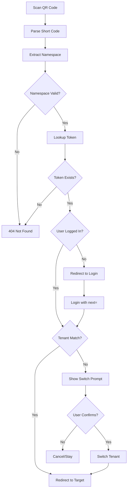
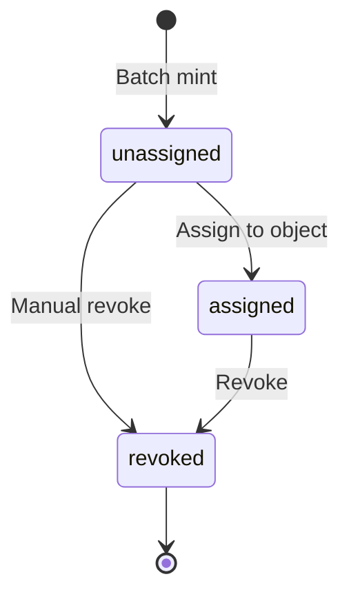

# 11. QR Routing System

## Overview

Homebot uses a namespaced QR code system for tracking inventory items, containers, and locations. The system supports:

- Pre-printed label sheets that can be assigned later
- Multi-tenant isolation via namespace codes
- Human-readable codes with error correction
- Flexible routing to different object types

---

## Related Decisions

See [decisions.md](decisions.md) for detailed decision records:
- DEC-038: QR code alphabet (Crockford Base32)
- DEC-039: QR code format (NS-CODE-CHECK)
- DEC-040: QR code lengths
- DEC-041: Namespace length (3 chars)
- DEC-042: Cross-tenant transfer policy
- DEC-043: Human-readable formatting
- DEC-044: Token states

---

## 1. QR Code Format Specification

### 1.1 Alphabet: Crockford Base32

The system uses Crockford Base32 encoding to avoid visually ambiguous characters.

**Character Set:** `0123456789ABCDEFGHJKMNPQRSTVWXYZ`

**Excluded Characters:**
- `I` - confused with `1` or `l`
- `L` - confused with `1` or `I`
- `O` - confused with `0`
- `U` - avoids accidental obscenities

### 1.2 Code Structure

Format: `NS-CODE-CHECK`

| Component | Length | Purpose | Capacity |
|-----------|--------|---------|----------|
| NS (Namespace) | 3 chars | Tenant identifier | 32,768 namespaces |
| CODE | 5 chars | Unique item identifier | 33,554,432 per namespace |
| CHECK | 1 char | Checksum digit | Error detection |

**Example:** `K3D-7K3QF-X`

### 1.3 Capacity Analysis

- **Namespaces:** 32³ = 32,768 possible tenant namespaces
- **Codes per namespace:** 32⁵ = 33,554,432 unique codes
- **Total address space:** ~1.1 × 10¹² unique codes

This provides more than enough capacity for home inventory use cases.

### 1.4 Separators

Separators are included for human readability:

- **Printed format:** `K3D-7K3QF-X` (with dashes)
- **URL format:** `K3D-7K3QF-X` (with dashes)
- **Input normalization:** Accept both `K3D-7K3QF-X` and `K3D7K3QFX`

---

## 2. QR URL Structure

### 2.1 Encoded URL

QR codes encode a full URL for direct scanning:

```
https://{host}/q/{short_code}
```

**Examples:**
- `https://homebot.example.com/q/K3D-7K3QF-X`
- `https://homebot.local/q/K3D-7K3QF-X`

### 2.2 Resolution Flow



---

## 3. Token States

QR tokens have a lifecycle with defined states:

| State | Description | Transitions To |
|-------|-------------|----------------|
| `unassigned` | Pre-printed, not yet bound | `assigned`, `revoked` |
| `assigned` | Bound to container or instance | `revoked` |
| `revoked` | Permanently deactivated | (none) |

### 3.1 Token Lifecycle



### 3.2 Assignment Rules

- A token can only be assigned once
- Revoked tokens are never reused
- Tokens are scoped to their namespace (tenant)

---

## 4. Database Schema

### 4.1 QR Namespaces Table

```sql
CREATE TABLE qr_namespaces (
    id UUID PRIMARY KEY DEFAULT gen_random_uuid(),
    tenant_id UUID NOT NULL REFERENCES tenants(id),
    code VARCHAR(4) NOT NULL, -- 3-char Crockford Base32
    name VARCHAR(255),
    is_default BOOLEAN DEFAULT FALSE,
    created_at TIMESTAMPTZ DEFAULT NOW(),
    UNIQUE (code) -- Globally unique namespace codes
);

-- Index for code lookups
CREATE INDEX idx_qr_namespaces_code ON qr_namespaces(code);

-- RLS
ALTER TABLE qr_namespaces ENABLE ROW LEVEL SECURITY;
CREATE POLICY qr_namespaces_tenant_isolation ON qr_namespaces
    USING (tenant_id = current_setting('app.tenant_id')::uuid);
```

### 4.2 QR Tokens Table

```sql
CREATE TABLE qr_tokens (
    id UUID PRIMARY KEY DEFAULT gen_random_uuid(),
    tenant_id UUID NOT NULL REFERENCES tenants(id),
    namespace_id UUID NOT NULL REFERENCES qr_namespaces(id),
    code VARCHAR(6) NOT NULL, -- 5-char code + checksum
    full_code VARCHAR(12) NOT NULL, -- NS-CODE-CHECK format
    state VARCHAR(20) NOT NULL DEFAULT 'unassigned',
    target_type VARCHAR(50), -- 'product_instance', 'container', 'location'
    target_id UUID,
    batch_id UUID REFERENCES qr_batches(id),
    assigned_at TIMESTAMPTZ,
    revoked_at TIMESTAMPTZ,
    created_at TIMESTAMPTZ DEFAULT NOW(),
    UNIQUE (full_code),
    CONSTRAINT valid_state CHECK (state IN ('unassigned', 'assigned', 'revoked')),
    CONSTRAINT assigned_has_target CHECK (
        (state = 'assigned' AND target_type IS NOT NULL AND target_id IS NOT NULL)
        OR state != 'assigned'
    )
);

-- Indexes
CREATE INDEX idx_qr_tokens_full_code ON qr_tokens(full_code);
CREATE INDEX idx_qr_tokens_target ON qr_tokens(target_type, target_id);
CREATE INDEX idx_qr_tokens_namespace ON qr_tokens(namespace_id);

-- RLS
ALTER TABLE qr_tokens ENABLE ROW LEVEL SECURITY;
CREATE POLICY qr_tokens_tenant_isolation ON qr_tokens
    USING (tenant_id = current_setting('app.tenant_id')::uuid);
```

### 4.3 QR Batches Table

```sql
CREATE TABLE qr_batches (
    id UUID PRIMARY KEY DEFAULT gen_random_uuid(),
    tenant_id UUID NOT NULL REFERENCES tenants(id),
    namespace_id UUID NOT NULL REFERENCES qr_namespaces(id),
    quantity INTEGER NOT NULL,
    label_template_id UUID REFERENCES print_templates(id),
    created_at TIMESTAMPTZ DEFAULT NOW(),
    printed_at TIMESTAMPTZ
);

-- RLS
ALTER TABLE qr_batches ENABLE ROW LEVEL SECURITY;
CREATE POLICY qr_batches_tenant_isolation ON qr_batches
    USING (tenant_id = current_setting('app.tenant_id')::uuid);
```

---

## 5. API Endpoints

### 5.1 Token Resolution

```
GET /q/{short_code}
```

**Public endpoint** - resolves QR code and redirects.

**Response:**
- `302 Found` - Redirect to SPA route
- `404 Not Found` - Invalid code or revoked token

**Headers:**
- `X-QR-Tenant-ID` - Tenant ID for the token (for client handling)
- `X-QR-Target-Type` - Target object type
- `X-QR-Target-ID` - Target object ID

### 5.2 Batch Minting

```
POST /api/v2/qr/batches
```

**Request:**
```json
{
  "namespace_id": "uuid",
  "quantity": 100,
  "label_template_id": "uuid"
}
```

**Response:**
```json
{
  "batch_id": "uuid",
  "tokens": [
    { "id": "uuid", "full_code": "K3D-7K3QF-X", "state": "unassigned" }
  ],
  "count": 100
}
```

### 5.3 Token Assignment

```
POST /api/v2/qr/tokens/{token_id}/assign
```

**Request:**
```json
{
  "target_type": "product_instance",
  "target_id": "uuid"
}
```

### 5.4 Token Lookup

```
GET /api/v2/qr/tokens/{full_code}
```

**Response:**
```json
{
  "id": "uuid",
  "full_code": "K3D-7K3QF-X",
  "state": "assigned",
  "target_type": "product_instance",
  "target_id": "uuid",
  "target": {
    // Full target object
  }
}
```

### 5.5 Batch Sheet Generation

```
POST /api/v2/qr/batches/{batch_id}/generate-sheet
```

**Response:** PDF file with printable label sheet.

---

## 6. Checksum Algorithm

The checksum ensures detection of common transcription errors.

### 6.1 Luhn Mod 32

Use Luhn mod 32 algorithm for checksum calculation:

```python
CROCKFORD_ALPHABET = "0123456789ABCDEFGHJKMNPQRSTVWXYZ"

def calculate_checksum(code: str) -> str:
    """Calculate Luhn mod 32 checksum for a code."""
    total = 0
    for i, char in enumerate(reversed(code)):
        value = CROCKFORD_ALPHABET.index(char.upper())
        if i % 2 == 1:
            value *= 2
            if value >= 32:
                value = (value // 32) + (value % 32)
        total += value
    checksum = (32 - (total % 32)) % 32
    return CROCKFORD_ALPHABET[checksum]

def validate_code(full_code: str) -> bool:
    """Validate a code including checksum."""
    # Remove separators
    clean = full_code.replace("-", "").upper()
    if len(clean) != 9:  # 3 + 5 + 1
        return False
    code_part = clean[:8]
    checksum = clean[8]
    return calculate_checksum(code_part) == checksum
```

### 6.2 Normalization

```python
def normalize_code(input_code: str) -> str:
    """Normalize user input to standard format."""
    # Uppercase and remove spaces/separators
    clean = input_code.upper().replace("-", "").replace(" ", "")
    
    # Validate length
    if len(clean) != 9:
        raise ValueError("Invalid code length")
    
    # Format as NS-CODE-CHECK
    return f"{clean[:3]}-{clean[3:8]}-{clean[8]}"
```

---

## 7. Label Printing Integration

### 7.1 Label Format

QR code labels include:

- QR code encoding the full URL
- Human-readable short code below
- Optional product/container name (if assigned)

### 7.2 Pre-printed Label Sheets

For bulk printing unassigned labels:

1. Create batch with quantity
2. Generate label sheet PDF
3. Print on Brother QL or sheet printer
4. Labels remain `unassigned` until scanned and bound

### 7.3 On-Demand Labels

For assigned items:

1. Item created with new QR token
2. Label printed immediately
3. Token is `assigned` from creation

---

## 8. Security Considerations

### 8.1 Token Enumeration

- Tokens are not sequential
- Random 5-char codes provide 33M+ possible values per namespace
- Checksum prevents simple guessing

### 8.2 Tenant Isolation

- Namespace codes are globally unique but tenant-scoped
- RLS enforces tenant isolation on token queries
- `/q/*` endpoint only reveals tenant mismatch, not details

### 8.3 Revocation

- Revoked tokens return 404, not "revoked" status
- No information leakage about why a code is invalid

---

## Tasks Summary

Tasks derived from this PRD for Ralph execution:

| Task ID | Description | Phase | Priority |
|---------|-------------|-------|----------|
| HB-QR-01 | Create qr_namespaces table with RLS | 1 | P0 |
| HB-QR-02 | Create qr_tokens table with RLS | 1 | P0 |
| HB-QR-03 | Create qr_batches table with RLS | 1 | P0 |
| HB-QR-04 | Implement Crockford Base32 encoding | 1 | P0 |
| HB-QR-05 | Implement Luhn mod 32 checksum | 1 | P0 |
| HB-QR-06 | Create /q/{code} resolution endpoint | 1 | P0 |
| HB-QR-07 | Create batch minting API | 2 | P1 |
| HB-QR-08 | Create token assignment API | 1 | P0 |
| HB-QR-09 | Create label sheet PDF generation | 2 | P1 |
| HB-QR-10 | Implement tenant mismatch handling | 3 | P2 |
